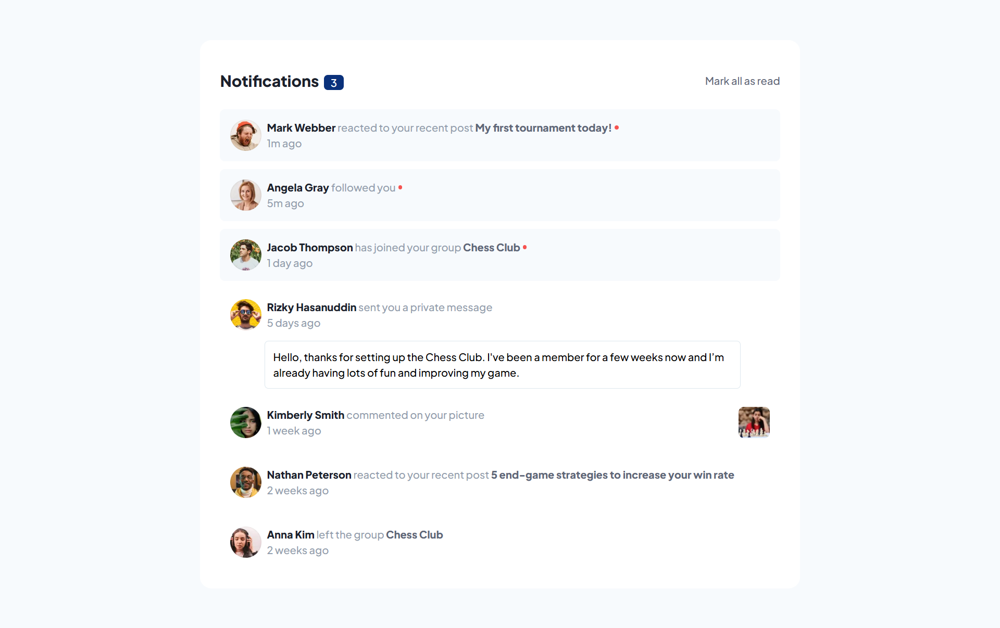
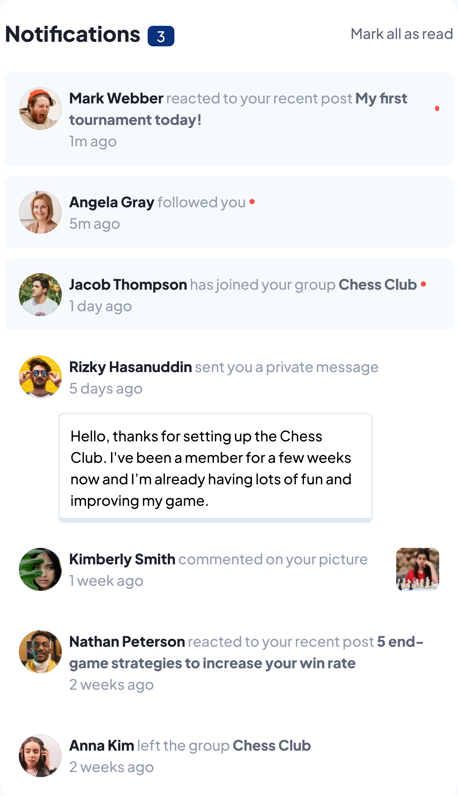

# Frontend Mentor - Notifications page solution

This is a solution to the [Notifications page challenge on Frontend Mentor](https://www.frontendmentor.io/challenges/notifications-page-DqK5QAmKbC). Frontend Mentor challenges help you improve your coding skills by building realistic projects.

## Table of contents

- [Overview](#overview)
    - [The challenge](#the-challenge)
    - [Screenshot](#screenshot)
    - [Links](#links)
- [My process](#my-process)
    - [Built with](#built-with)
    - [What I learned](#what-i-learned)
- [Author](#author)
- [Acknowledgments](#acknowledgments)

## Overview

### The challenge

### Screenshot




### Links

- Solution URL: [https://github.com/molindu/notifications-page-main](https://github.com/molindu/notifications-page-main)
- Live Site URL: [https://molindu.github.io/notifications-page-main/](https://molindu.github.io/notifications-page-main/)

## My process

### Built with

- Semantic HTML5 markup
- CSS custom properties
- Flexbox
- CSS Grid
- Mobile-first workflow
- [React](https://reactjs.org/) - JS library
- [Tailwind]() - For styles

### What I learned

```js
 useEffect(() => {
  setLoading(true);
  fetch("https://684ce0bf65ed087139147af0.mockapi.io/notifications")
          .then((res) => {
            if (!res.ok) {
              throw new Error("Failed to fetch notifications");
            }
            return res.json();
          })
          .then((data) => setNotifications(data))
          .catch((err) => setError(err.message))
          .finally(() => setLoading(false));
}, []);

```

## Author

- Frontend Mentor - [@molindu](https://www.frontendmentor.io/profile/molindu)

## Acknowledgments

### other references

- []()
- []()